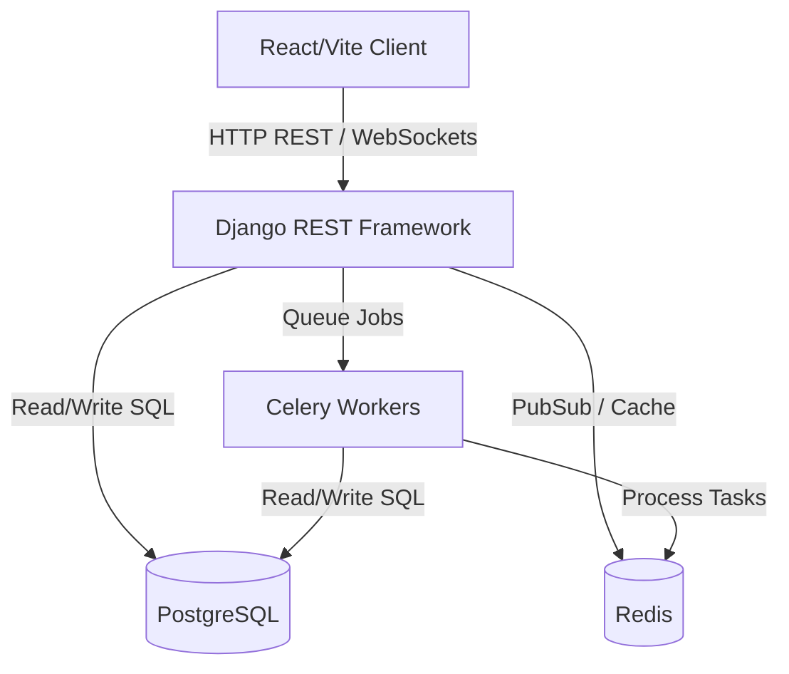

# System Architecture Documentation

This document describes the high-level system architecture of the Restaurant ERP platform, detailing the design patterns, technical stack, service layers, and networking topology.

---

## 🚀 Technical Stack

Our architecture is split into a decoupled, modern multi-service stack:

### 1. Presentation Layer (Frontend)
- **Vite & React 19**: Faster bundle speeds and progressive rendering.
- **Vanilla CSS (Premium Styles)**: HSL-tuned colors, responsive styling system, custom dark/red themes, and responsive design layouts.
- **Razorpay Checkout SDK**: Payment interface for the client.

### 2. API & Real-time Router Layer (Backend)
- **Django 5 & Django REST Framework (DRF)**: Handles core business logic, permissions, validation, and REST API exposure.
- **Django Channels (ASGI)**: Handles live, real-time WebSocket protocol handshakes for active notification channels.
- **SimpleJWT**: Secure JSON Web Token authentication system.

### 3. Asynchronous Worker Layer
- **Celery**: Background queue execution engine for non-blocking work (generating invoices, recalculating inventory safety stock, running forecasting jobs).
- **Redis**: Acts as the Celery broker, WebSocket backing store (Channel Layer), and general server cache.

### 4. Data Layer
- **PostgreSQL**: Primary transactional database storing relations (orders, users, inventory ledger, branches).

---

## 🏛️ System Layer Model

The system follows a clean modular layering pattern:

1. **Client Interface**: Captures and routes user interactions, state caching, and displays data.
2. **API Gate / Routing**: Validates authentication tokens (SimpleJWT Bearer) and routes paths to appropriate controllers.
3. **Service Logic (Views & Serializers)**: Maps database state to JSON payloads, executes domain rules (e.g. inventory deduction upon order prep).
4. **Data Access (ORMs & SQL)**: Manages persistence, transactions, index caching, and foreign key relations.

---

## 🌐 Container Networking & Security

Services communicate over a isolated, default bridge network in Docker Compose:
- **Port `8000` (Backend API)**: Bound to the host to accept frontend REST queries and WebSocket connects.
- **Port `5173` (Frontend)**: Exposed for client web access.
- **Port `5432` (PostgreSQL) & Port `6379` (Redis)**: Internally linked. Host mappings are bound for admin inspections in development, but closed to external access in production.
- **CORS Configuration**: Django is locked to restrict unauthorized origins, configured via `CORS_ALLOW_ALL_ORIGINS = True` in local testing.
