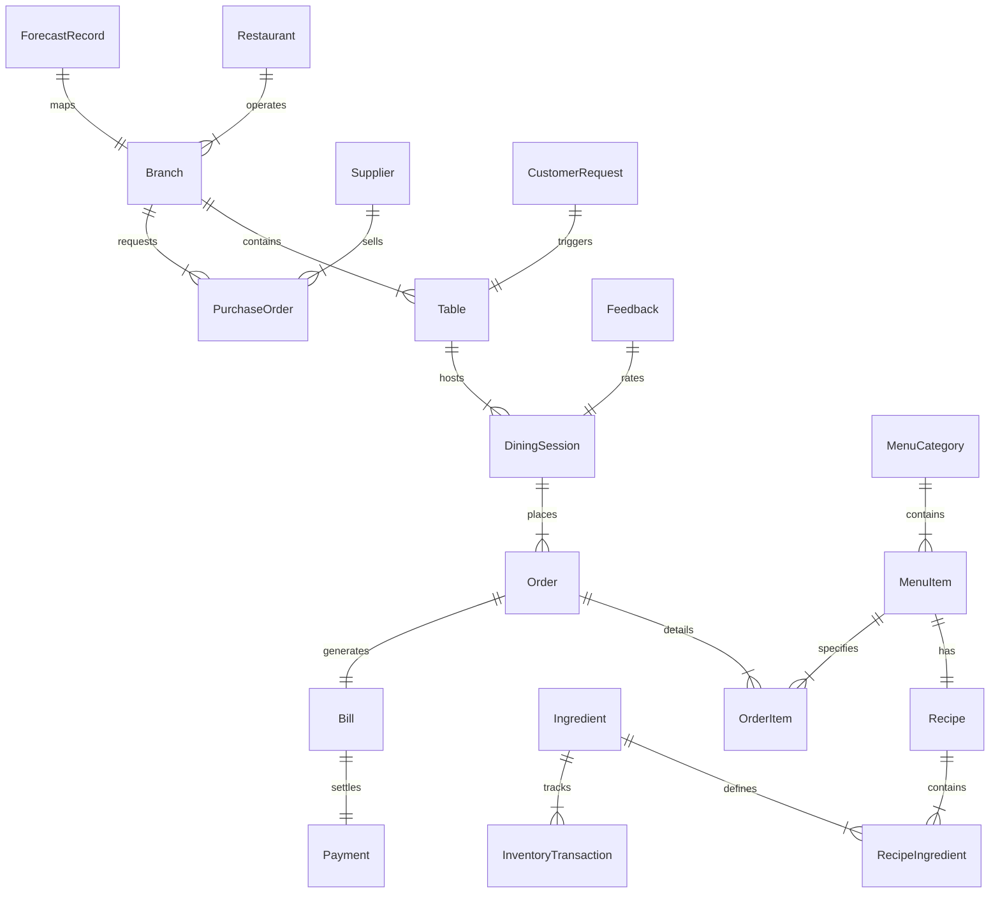

# Database Design Documentation

This document describes the database schema design, detailing the primary keys, foreign relationships, audit properties, and business constraints for all 21 tables.

---

## 🏛️ Conceptual Relations

---

## 📋 Table Specifications

### 1. Restaurant
- **Purpose**: High-level corporate parent entity.
- **Fields**:
  - `id` (UUID, Primary Key)
  - `name` (CharField, max_length=100)
  - `logo_url` (URLField, blank=True)
  - `created_at` (DateTimeField, auto_now_add=True)

### 2. Branch
- **Purpose**: Represents individual physical locations/outlets.
- **Fields**:
  - `id` (UUID, Primary Key)
  - `restaurant_id` (ForeignKey pointing to Restaurant, on_delete=CASCADE)
  - `name` (CharField, max_length=100)
  - `address` (TextField)
  - `phone` (CharField, max_length=20)
  - `created_at` (DateTimeField, auto_now_add=True)

### 3. User
- **Purpose**: Authenticated system users (Owner, Waiter, Chef, Admin). Customers are guest users authenticated via OTP and bound dynamically by mobile number.
- **Fields**:
  - Standard Django `User` model:
    - `id` (Integer, Primary Key)
    - `username` (CharField, unique, holds mobile or email)
    - `email` (EmailField)
    - `is_staff`, `is_active` (Booleans)
  - Profile attributes (Role enum: `'ADMIN'`, `'OWNER'`, `'CHEF'`, `'WAITER'`).

### 4. Table
- **Purpose**: Identifies dining tables linked to specific branches for QR ordering lock-in.
- **Fields**:
  - `id` (UUID, Primary Key)
  - `branch_id` (ForeignKey to Branch)
  - `number` (CharField, max_length=10)
  - `qr_code_url` (URLField)
  - `status` (CharField choices: `'AVAILABLE'`, `'OCCUPIED'`)

### 5. DiningSession
- **Purpose**: Tracks a customer group seated at a table from check-in to final payment.
- **Fields**:
  - `id` (UUID, Primary Key)
  - `table_id` (ForeignKey to Table)
  - `customer_phone` (CharField, max_length=20)
  - `active` (BooleanField, default=True)
  - `start_time` (DateTimeField, auto_now_add=True)
  - `end_time` (DateTimeField, null=True)

### 6. MenuCategory
- **Purpose**: Grouping items (e.g. Starters, Mains, Desserts, Cocktails).
- **Fields**:
  - `id` (UUID, Primary Key)
  - `branch_id` (ForeignKey to Branch, optional for multi-branch sync)
  - `name` (CharField, max_length=50)

### 7. MenuItem
- **Purpose**: Individual food/beverage selections.
- **Fields**:
  - `id` (UUID, Primary Key)
  - `category_id` (ForeignKey to MenuCategory)
  - `name` (CharField, max_length=100)
  - `description` (TextField)
  - `price` (DecimalField, max_digits=8, decimal_places=2)
  - `is_available` (BooleanField, default=True)

### 8. Recipe
- **Purpose**: Link menu items to their required cooking recipes.
- **Fields**:
  - `id` (UUID, Primary Key)
  - `menu_item_id` (OneToOneField to MenuItem)
  - `instructions` (TextField)

### 9. Ingredient
- **Purpose**: Raw materials tracked for stock count.
- **Fields**:
  - `id` (UUID, Primary Key)
  - `name` (CharField, max_length=100)
  - `sku` (CharField, unique)
  - `unit` (CharField choices: `'KG'`, `'LITRE'`, `'UNIT'`, `'GRAM'`)
  - `current_stock` (DecimalField)
  - `safety_stock` (DecimalField, threshold for alert trigger)

### 10. RecipeIngredient
- **Purpose**: Relational link mapping amount of ingredients consumed per recipe execution.
- **Fields**:
  - `id` (UUID, Primary Key)
  - `recipe_id` (ForeignKey to Recipe)
  - `ingredient_id` (ForeignKey to Ingredient)
  - `quantity_required` (DecimalField)

### 11. InventoryTransaction
- **Purpose**: Ledger tracking any stock increases (purchases) or decreases (kitchen usage, waste).
- **Fields**:
  - `id` (UUID, Primary Key)
  - `ingredient_id` (ForeignKey to Ingredient)
  - `quantity` (DecimalField)
  - `transaction_type` (CharField choices: `'PURCHASE'`, `'CONSUMPTION'`, `'WASTE'`, `'ADJUSTMENT'`)
  - `timestamp` (DateTimeField, auto_now_add=True)

### 12. Supplier
- **Purpose**: Catalog of raw material suppliers.
- **Fields**:
  - `id` (UUID, Primary Key)
  - `name` (CharField)
  - `contact_person` (CharField)
  - `email`, `phone` (Fields)

### 13. PurchaseOrder
- **Purpose**: Requisitions sent to suppliers for raw ingredients restocking.
- **Fields**:
  - `id` (UUID, Primary Key)
  - `supplier_id` (ForeignKey to Supplier)
  - `branch_id` (ForeignKey to Branch)
  - `total_cost` (DecimalField)
  - `status` (CharField choices: `'PENDING'`, `'SHIPPED'`, `'DELIVERED'`)
  - `created_at` (DateTimeField, auto_now_add=True)

### 14. Order
- **Purpose**: Tracks client meal orders.
- **Fields**:
  - `id` (UUID, Primary Key)
  - `session_id` (ForeignKey to DiningSession)
  - `status` (CharField choices: `'PLACED'`, `'PREPARING'`, `'READY'`, `'SERVED'`, `'CANCELLED'`)
  - `created_at` (DateTimeField, auto_now_add=True)

### 15. OrderItem
- **Purpose**: Individual items added inside an order.
- **Fields**:
  - `id` (UUID, Primary Key)
  - `order_id` (ForeignKey to Order)
  - `menu_item_id` (ForeignKey to MenuItem)
  - `quantity` (IntegerField)
  - `notes` (CharField, special requests)

### 16. Bill
- **Purpose**: Invoice sheet summarizing subtotal, service charges, GST.
- **Fields**:
  - `id` (UUID, Primary Key)
  - `session_id` (ForeignKey to DiningSession)
  - `subtotal` (DecimalField)
  - `gst` (DecimalField, 5%)
  - `service_charge` (DecimalField, 2%)
  - `total_amount` (DecimalField)
  - `is_settled` (BooleanField, default=False)

### 17. Payment
- **Purpose**: Settle bills securely.
- **Fields**:
  - `id` (UUID, Primary Key)
  - `bill_id` (OneToOneField to Bill)
  - `payment_method` (CharField choices: `'RAZORPAY'`, `'CASH'`, `'CARD'`)
  - `transaction_id` (CharField, blank=True)
  - `status` (CharField choices: `'PENDING'`, `'SUCCESS'`, `'FAILED'`)
  - `timestamp` (DateTimeField, auto_now_add=True)

### 18. Feedback
- **Purpose**: Capture dining session star ratings and notes.
- **Fields**:
  - `id` (UUID, Primary Key)
  - `session_id` (ForeignKey to DiningSession)
  - `rating` (IntegerField, 1 to 5)
  - `comments` (TextField, blank=True)

### 19. Notification
- **Purpose**: Dispatch live alerts across staff channels.
- **Fields**:
  - `id` (UUID, Primary Key)
  - `message` (TextField)
  - `role_target` (CharField, e.g. `'WAITER'`, `'CHEF'`)
  - `is_read` (BooleanField, default=False)
  - `created_at` (DateTimeField, auto_now_add=True)

### 20. CustomerRequest
- **Purpose**: Direct waiter summons (e.g. Request Water, Call Waiter).
- **Fields**:
  - `id` (UUID, Primary Key)
  - `table_id` (ForeignKey to Table)
  - `request_type` (CharField, e.g. `'WATER'`, `'BILL'`, `'ASSISTANCE'`)
  - `status` (CharField choices: `'PENDING'`, `'COMPLETED'`)
  - `timestamp` (DateTimeField, auto_now_add=True)

### 21. ForecastRecord
- **Purpose**: Houses AI predictions for future inventory needs.
- **Fields**:
  - `id` (UUID, Primary Key)
  - `branch_id` (ForeignKey to Branch)
  - `ingredient_id` (ForeignKey to Ingredient)
  - `forecast_date` (DateField)
  - `predicted_consumption` (DecimalField)
