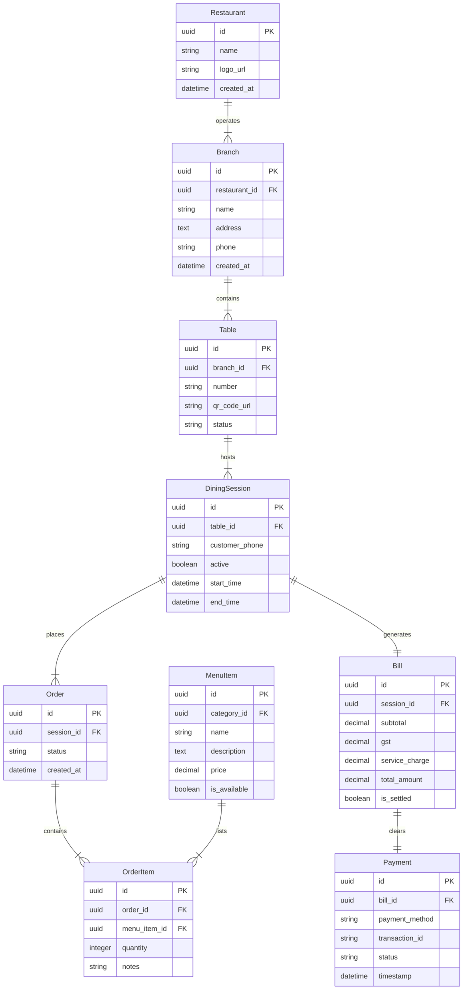
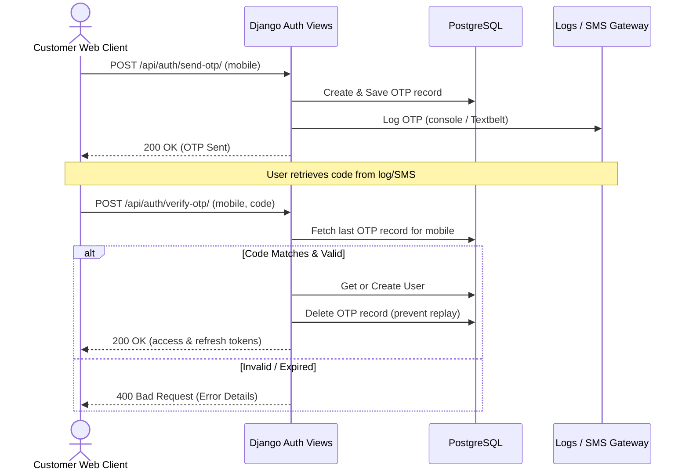
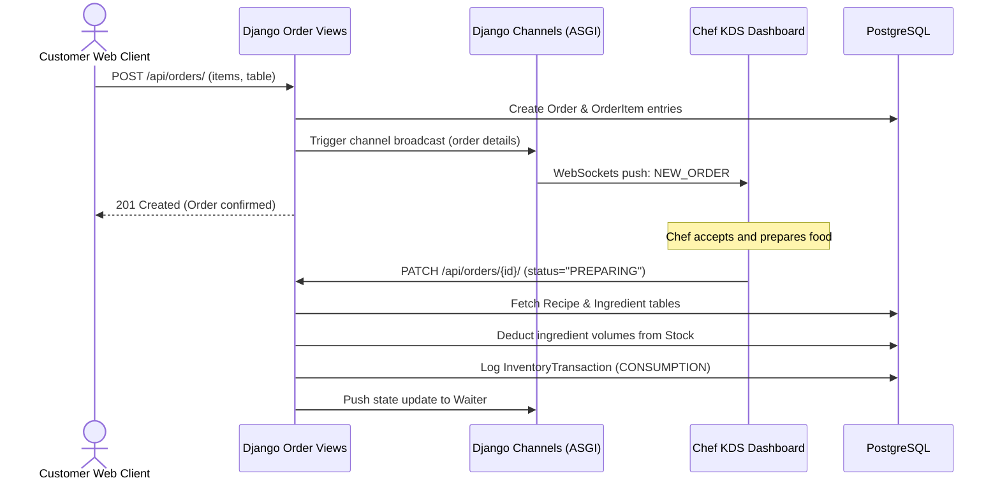
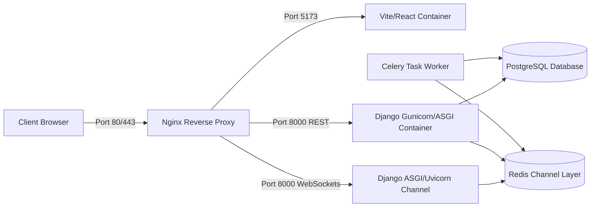

# System Design Specification

This document details the database Entity Relationship Diagram (ERD), user workflows, API sequence mappings, and infrastructure deployment layouts.

---

## 📊 Entity Relationship Diagram (ERD)

The relational schema maps our database layout:

---

## 🔄 Sequence Diagrams

### 1. Mobile OTP Authentication Flow

### 2. Order Placement & KDS Processing Flow

---

## 🚢 Deployment Diagram

Our production and local docker stack maps services inside an Nginx gateway:

